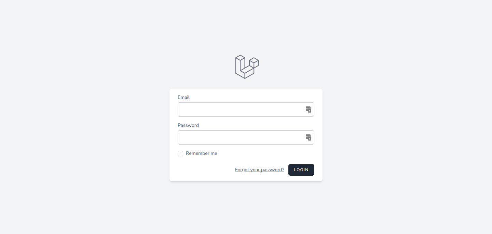

# BIT coursework: final project demo

Travel agency platform, that allows travel agents to add customers, destinantion countries and cities.

Built using laravel, with breeze as auth scaffold and tailwindcss for styling. 

**Takeawys**
Built in **5 Hours**. Not enough time to add request data validation, use repository pattern adn write tests.

## Requirements

**Time limit: 5h**

* :heavy_check_mark: TA can read/add/edit countries
* :heavy_check_mark: TA can read/add/edit/remove cities
* :heavy_check_mark: TA can add new cities to countries
* :heavy_check_mark: TA can add customer and assign country
* :heavy_check_mark: TA can see how many towns are available in each county
* :heavy_check_mark: Countries and cities are shown in a list view
* :heavy_check_mark: TA can do CRUD actions to customers
* :heavy_check_mark: TA can view each client and country he wants to visit
* :heavy_check_mark: TA can filter clients by name
* :heavy_check_mark: TA can filter countries by name
* :heavy_check_mark: TA can filter cities by name
* :heavy_check_mark: Authentication
* :heavy_check_mark: USE WYSIWYG editor when adding/editing country

## How to install

```bash

# clone repository
git clone git@github.com:EvaldasBurlingis/bit-final-project-demo.git

# change directory
cd bit-final-project-demo

# install all dependencies
composer update

npm install

npm run dev

# copy .env.example file
cp .env.expample .env

# add your database to .env

# generate app key
php artisan key:generate

# run migrations and seeders
php artisan migrate:refresh --seed

# start application
php artisan serve

# email: admin@admin.com
# password: password
```

## Screenshots

* Login screen


---

* Customers table


---

* Customer filter


---

* Countries


---

* Country


--- 

* Add new city
